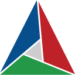

# 👋🏼 Hi, I'm Matze! 🔆

### I love coding, especially if it is something about graphics and colorful light 🦄

### ⚙️ My primary toolchain

<table>
  <tr>
    <td valign="top" align="center" width="96px">
        
         C++
    </td>
    <td valign="top" align="center" width="96px">
        
         Vulkan
    </td>
    <td valign="top" align="center" width="96px">
        
         ArchLinux btw
    </td>
    <td valign="top" align="center" width="96px">
        
         Neovim
    </td>
    <td valign="top" align="center" width="96px">
        
         Git
    </td>
  </tr>
</table>
<table>
  <tr>
    <td valign="top" align="center" width="96px">
        
         GCC
    </td>
    <td valign="top" align="center" width="96px">
        
         GDB
    </td>
    <td valign="top" align="center" width="96px">
        
         Nsight Graphics
    </td>
    <td valign="top" align="center" width="96px">
        
         Renderdoc
    </td>
    <td valign="top" align="center" width="96px">
        
         CMake
    </td>
  </tr>
</table>

### 🎓 Stuff I know about by accident

<table>
  <tr>
    <td valign="top" align="center" width="96px">
        
         C
    </td>
    <td valign="top" align="center" width="96px">
        
         Python
    </td>
    <td valign="top" align="center" width="96px">
        
         Lua
    </td>
    <td valign="top" align="center" width="96px">
        
         Bash
    </td>
    <td valign="top" align="center" width="96px">
        
         LaTeX
    </td>
    <td valign="top" align="center" width="96px">
        
         Haskell
    </td>
    <td valign="top" align="center" width="96px">
        
         Java
    </td>
  </tr>
</table>
